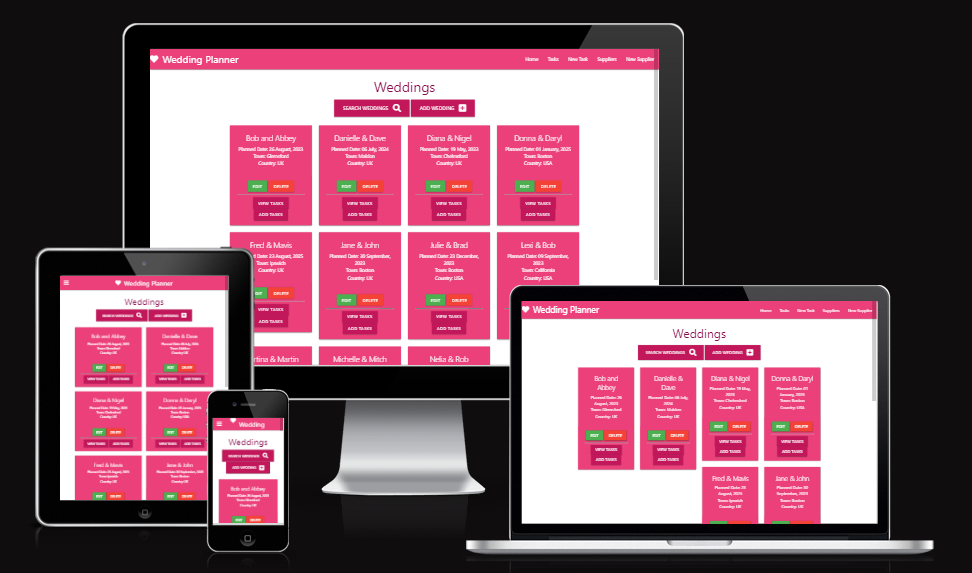

# Wedding Planner

### This is the website for a Wedding Planner Application. It is designed to be responsive and accessible on a range of devices, making it easy to navigate for potential users.

[View the live project here.](https://ci-ms3-weddingplanner.herokuapp.com/)

#

### A screenshot of the responsive website:

#

## Project Scope

    To build a website for users to plan their wedding. They can add their wedding with a unique wedding name (e.g. 'Diana & Nigel'), add tasks for the wedding (e.g. 'Book Licensed Venue') and add suppliers for those tasks (e.g. 'The Lion Inn'). 
    
    All this information should be viewable in a clear format not only for the users wedding but all the other weddings added to the website, hence the comunity aspect.
    
    Weddings, tasks and suppliers should be editable and can be deleted if required. Futhermore, a set of default tasks can be added to a wedding to assit the user in their planning and suppliers from other wedding tasks can be copied to the users wedding task as they see fit.

#

## Future Enhancements

    1. Provide a log in screen so that users can only edit and delete their own wedding, tasks and suppliers.

    2. Provide a priority task list to see what needs to be arranged/completed next.

#

## User Experience (UX)

-    ### User stories

    -   First Time Visitor Goals:
        1. As a First Time Visitor, I want to easily understand the main purpose of the site.
        2. As a First Time Visitor, I want to be able to easily view existing weddings, tasks and suppliers
           in a clear presentation that is responsive on different devices.
        3. As a First Time Visitor, I want to be able to easily search weddings based on the wedding name,
           wedding country and/or wedding town.
        4. As a First Time Visitor, I want to be able to easily add a wedding, a task(s) for a wedding,
           a supplier(s) for those tasks and view all this information in clear presentation that is 
           responsive on different devices.
        5. As a First Time Visitor, I want to be able to easily edit or delete a wedding, task or supplier.
        6. As a First Time Visitor, I want to be able to add a default set of tasks for thier wedding to 
           assist in the set up and planning of their wedding.
        7. As a First Time Visitor, I want to be able to copy a supplier from a selected wedding and task
           to their own wedding and task.
        
    -   Returning & Frequent Visitor Goals:
        1. As a Returning Visitor, I want to quickly access the site and view the status of my wedding tasks
           and task suppliers in a clear presentation that is responsive on different devices.
        2. As a Returning Visitor, I want to be able to update the status of my wedding by adding, editing or
           deleting planning wedding tasks and task suppliers.

-   ### UX Design

    -   #### Frontend Framework
        To create a modern responsive site Google's Material Design Materialize CSS framework is used. The responsive
        behavior is based on the standard 12-column grid system using containers, rows, and columns.

    -   #### Colour Scheme
        To create a modern look and feel in a wedding theme that is clear to new users and familiar to a returning user.
        One of the benefits of using Google's Material Design is that there are 200 custom color classes that can be used
        use for backgrounds and text.

    -   #### Typography
        Roboto 2.0 is the font used on the site. It is the standard font of Materialize and features friendly and open
        curves making a more natural reading rhythm.

    -   #### Imagery
        Imagery is important but has been kept to a minimum to improve the sites upload time.

    -   #### Screenshots of the visual design elements used on the site:
        - ##### Weddings page
        
        - ##### Wedding tasks page
        
        - ##### Task suppliers page
        
        - ##### Search weddings form
        
        - ##### Add wedding form
        
        - ##### Add tasks dialog
        
        - ##### Add task form
        
        - ##### Add supplier form
        

-   ### Wireframes

    -   #### The wireframes for a standard computer screen:
        

    -   #### The wireframes for a mobile device:
        

-   ### Backend/Database Design

    -   The backend will be a Postgres relational database accessed via Python using Flask, the SLQAlchemy ORM.

    -   #### Database schema:
        

-   ### Initial Coding

    -   The site was coded in Gitpod and based on the Relational Database Management System mini-project,
        a task manager application. Therefore the Wedding Planner application takes many of the features
        and setup from from this resource.

-   ### Responsiveness

    -   The site was initially checked with Google Chrome's Dev Tools using the Device Toolbar to 
        check different device sizes, [screenshots below in test section.](#TestResp)

    -   The site was then run on a Nokia 3.1 mobile phone running Andriod version 10 with good results

#

## Features

-   Responsive on all device sizes
-   Interactive elements
-   Interactive front-end that responds to the users' actions, allowing users to actively engage with 
    data, alter the way the site displays the information to achieve their preferred goals.

#

## Technologies Used

### Languages Used

-   [HTML5](https://en.wikipedia.org/wiki/HTML5)
-   [CSS3](https://en.wikipedia.org/wiki/Cascading_Style_Sheets)
-   [JavaScript](https://en.wikipedia.org/wiki/JavaScript)
-   [Python3](https://en.wikipedia.org/wiki/Python_(programming_language))

### Frameworks, Libraries & Programs Used

1. [W3 Schools:](https://www.w3schools.com/)
    - W3 Schools was used as a HTML and CSS reference.
2. [Code Institute](https://learn.codeinstitute.net/ci_program/diplomainwebappdevelopment)
    - The "Love Maths" project was used as the basis of the Four in a Line website.
3. [Stack Overflow](https://stackoverflow.com/)
    - Stack Overflow was used to search for solutions to specific requirements.
4. [Paint]
    - Paint for Windows was used to crop and resize the images/icons where required.
5. [Google Fonts:](https://fonts.google.com/)
    - Google fonts were used to import the 'Raleway' font into the style.css file which is used in the project.
6. [Git](https://git-scm.com/)
    - Git was used for version control by utilizing the Gitpod terminal to commit to Git and Push to GitHub.
7. [GitHub:](https://github.com/)
    - GitHub is used to store the project code after being pushed from Git.
8. [Figma:](https://figma.com/)
    - Figma was used to create the [wireframes](https://github.com/) during the design process.
9. [Material Design:](https://material.io/resources/color/)
    - Material Design was used to create and test the colour scheme for the website.
10. [Font Awesome](https://fontawesome.com/)
    - Font Awesome was used on the website to add icons for aesthetic and UX purposes.
11. [Lucidchart](https://www.lucidchart.com)
    - Lucidchart was used to design the database schema for the application.
12. [PostgreSQL](https://www.postgresql.org/)
    - A Postgres relational database will be used to store the application data for the site.
13. [Flask-SQLAlchemy](https://flask-sqlalchemy.palletsprojects.com/en/3.0.x/)
    - The Postgres relational database accessed via Python using Flask, the SLQAlchemy ORM.
14. [ElephantSQL](https://www.elephantsql.com/)
    - The Postgres relational database will be hosted on ElephantSQL.
15. [Heroku](https://www.heroku.com)
    - The site will be deployed on the Heroku Cloud Application Platform.
16. [Google Chrome]
    - The Device Toolbar in Dev Tools was used to check the responsiveness of the site.

## Testing

### HTML and CSS Validation

    The W3C Markup Validator and W3C CSS Validator services were used to validate every page of the project to ensure there were no syntax errors
    in the project. There were no errors found in the Markup but the in the CSS there was 1 error and 482 warnings in the Materialize framwork.

-   [W3C Markup Validator](https://validator.w3.org/) - [View results](weddingplanner/docs/html-validation-results.png)

-   [W3C CSS Validator](https://jigsaw.w3.org/css-validator/) - [View results](weddingplanner/docs/css-validation-results.png)

### Responsiveness
    
    The site was initially checked with Google Chrome's Dev Tools using the Device Toolbar to check different device sizes, screenshots below:

-   [View a screenshot of the standard computer](assets/docs/gc-resp-standard.png)
-   [View a screenshot of the Samsung Galaxy S8](assets/docs/gc-resp-samsunggs8.png)
-   [View a screenshot of the iPhone SE](assets/docs/gc-resp-iphonese.png)
-   [View a screenshot of the iPad Air](assets/docs/gc-resp-ipadair.png)

### Testing User Stories from User Experience (UX) Section

-   #### First Time Visitor Goals
  
    1. As a First Time Visitor, I want to easily understand the main purpose of the site.
        1. Upon entering the site, users can easily see what the purpose of the site is whether or not they are familiar with the Four in a Line game.
        2. The heading a logo clearly communicate what the site is about.
        3. The page is unclutterred with minimal elements to navigate so the user can concentrate on the game.
        4. The user can easily see who's turn it is next, if there has been a winner, the current scores and can restart the game.
        5. There are tooltips on the who's turn it is textbox and new game button to assist the user.
        6. The user can easily see instructions on how to play and the rules of the game.
        7. The user is alerted with a popup if they click a column that is full, if they carry on playing after a winner has been declared or if they click the new game button when the game is still in play.

    2. As a First Time Visitor, I want to be able to easily play the Four in a Line game in a clear 
       presentation that is responsive on different devices.
        1. The site has been designed to be easy to use and allow the user to concentrate on the game 
           using different devices such as a standard computer, laptop, tablet or mobile phone.
        2. The user can position a counter over a column with the cursor and "drop" the counter with a click. If the column is full the user is alerted with a popup.
        3. If the counter dropped is a winner the user is notified in the highlighted text box above the game table. 
    
    3. As a First Time Visitor, I want to be able to view how to play and the objective of the game.
        1. The user can easily find a description of the rules and objective of the game in a rules 
           section.

    4. As a First Time Visitor, I want to be able to view current scores.
        1. The user can easily see current scores under the game table.

    5. As a First Time Visitor, I want to be able to see who's turn it is next.
        1. The user can easily see who's turn it is next in a highlighted text box above the game table.

    6. As a First Time Visitor, I want to be able to see if the game has been won.
        1. The user can see the winner in a highlighted text box above the game table.

    7. As a First Time Visitor, I want to be able to reset the game and start a new one.
        1. The user can easily start a new game by pressing the New Game button above the game table.
        2. If the game is still in play a confirm popup is shown to the user.

-   #### Returning & Frequent Visitor Goals

    1. As a Returning Visitor, I want to quickly access the site and play the Four in a Line game as per 
       the first time visitor.
        1. The user can access the site quickly and start playing a new game as they are familiar with the rules and intuitive game design.

### Testing The Check For A Winner Algorithm

-   #### Algorithm Design

    The algorithm design follows a methodical approach, checking for a winner in the just dropped counters column, then row, then diagonal going right and finally diagonal going left. The testing followed this same approach with test scenarios to cover each eventuality.

-   #### Test Scenarios Performed

    1. Tests for win in column:
        1. Test for win in first column from bottom row up four counters, top row down four counters and then the middle four rows.
        2. Test for win in last column from bottom row up four counters, top row down four counters and then the middle four rows.
        3. Test for win in a middle column from bottom row up four counters, top row down four counters and then the middle four rows.

    2. Tests for win in row:
        1. Test for win in bottom row from first column across four counters, last column back across four counters and then in the middle columns across four counters.
        2. Test for win in top row from first column across four counters, last column back across four counters and then in the middle columns across four counters.
        3. Test for win in a middle row from first column across four counters, last column back across four counters and then in the middle columns across four counters.

    3. Tests for win diagonal going left to right:
        1. Test for win from bottom row first column diagonally across and then a middle column diagonally across.
        2. Test for win from top row diagonally back from the last column and then diagonally back from a middle column.
        3. Test for win from a middle row first column diagonally across and then a middle column diagonally across.
        4. Test for win from a middle row diagonally back from the last column and then diagonally back from a middle column.

    4. Tests for win diagonal going right to left:
        1. Test for win from bottom row last column diagonally back across and then a middle column diagonally back across.
        2. Test for win from top row diagonally across from the first column and then diagonally back from a middle column.
        3. Test for win from a middle row first column diagonally back across and then a middle column diagonally back across.
        4. Test for win from a middle row diagonally back from the last column and then diagonally back from a middle column.

### Further Testing

-   The Website was tested on Google Chrome, Internet Explorer, Microsoft Edge and Opera browsers.
-   The website was viewed on a variety of devices such as Desktop, Laptop, iPhone 6 and various Window 
    phones.
-   Friends and family members were asked to review the site on as many devices as they had available, 
    play the game and to point out any bugs and/or user experience issues.

### Known Bugs

-   No known bugs at this time!

#

## Deployment

### GitHub Pages

The project was deployed to GitHub Pages using the following steps...

1. Log in to GitHub and locate the [GitHub Repository](https://github.com/)
2. At the top of the Repository (not top of page), locate the "Settings" Button on the menu.
    - Alternatively Click [Here](https://raw.githubusercontent.com/) for a GIF demonstrating the process starting from Step 2.
3. Scroll down the Settings page until you locate the "Pages" Section on the left hand side of the screen.
4. Under "Source", click the dropdown and select "Deploy from a branch".
5. Under "Branch", click the first dropdown and select "main", "/ (root)" on the next dropdown, then "Save".
5. The page will automatically refresh.
6. Scroll back to the top of the page to locate the now published site next to "Your site is live at".

#

## Credits

### Code

-   The project was initailly coded alongside the "Love Maths" project and therefore takes some of the 
    features and source code from this resource.

### Content

-   All the site content was written by the developer.

### Media

-   

### Acknowledgements

-   Pasquale for his help and encouragement.

-   My Mentor for support and helpful feedback.

-   Slack group members for their help.